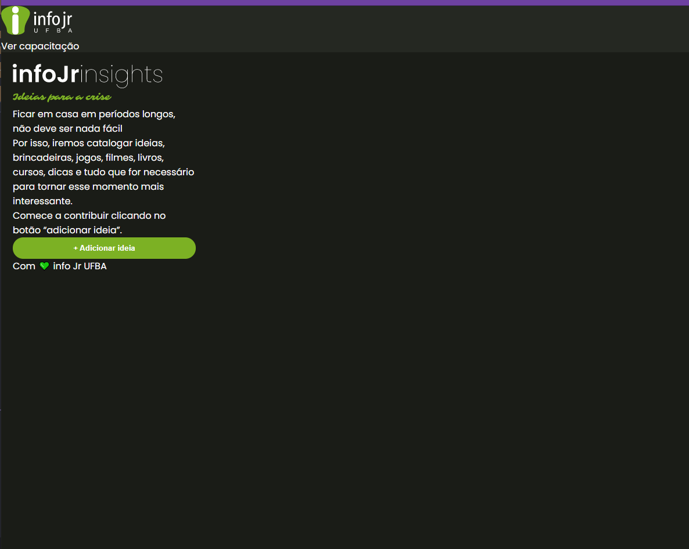

<h1 align="center">Capacitação HTML - CSS by InfoJr</h1>

## 💻 Sobre o projeto 

O projeto com base nos vídeos de capacitação da InfoJr 
Link para o instagram da InfoJr <a src="https://www.instagram.com/infojrufba/?hl=pt-br">InfoJr-Instagram</a>💚 
Link geral para outros domínios da InfoJr: <a src="https://linktr.ee/infojrufba">InfoJr-Geral</a>💚

  

