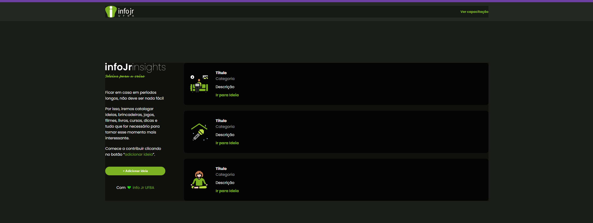

<h1 align="center">Capacitação HTML - CSS by InfoJr</h1>

## 💻 Sobre o projeto 

O projeto com base nos vídeos de capacitação da InfoJr 
Link para o instagram da InfoJr: [InfoJr-Instagram](https://www.instagram.com/infojrufba/?hl=pt-br)💚 
Link geral para outros domínios da InfoJr: [InfoJr-Geral](https://linktr.ee/infojrufba)💚

    <h2 align="center">Estado atual do site com base nos vídeos de capacitação</h2>
  

